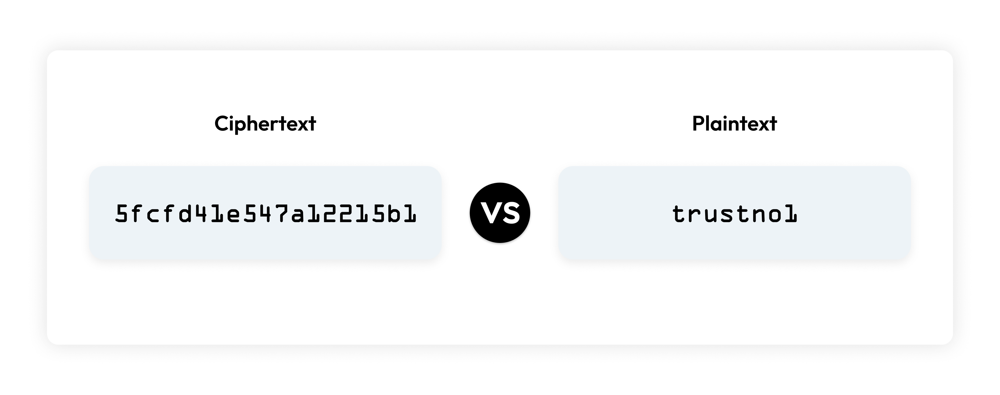

🛡️ __Ciphertext: ความหมายจากหลากหลายแหล่งข้อมูล__

📖 __CISSP Glossary - Student Guide__

Ciphertext: The altered form of a plaintext message, so as to be unreadable for anyone except the intended recipients. Something that has been turned into a secret.

แปล: Ciphertext คือรูปแบบที่เปลี่ยนแปลงมาจากข้อความปกติ (Plaintext) เพื่อทำให้ข้อความนั้นไม่สามารถอ่านได้ ยกเว้นสำหรับผู้รับที่ตั้งใจไว้เท่านั้น เป็นข้อมูลที่ถูกแปลงให้กลายเป็นความลับ

🤖 ChatGPT
Ciphertext คือ รูปแบบที่ถูกเปลี่ยนแปลงของข้อความที่เป็นข้อความปกติ เพื่อให้ไม่สามารถอ่านได้โดยผู้ที่ไม่ได้รับอนุญาต เป็นข้อความที่ถูกแปลงให้เป็นความลับ

🤖 Gemini
Ciphertext คือ ข้อความที่ถูกปรับเปลี่ยนรูปแบบเพื่อให้ผู้อื่นที่ไม่ใช่ผู้รับสารไม่สามารถอ่านได้ สิ่งที่ถูกเปลี่ยนให้กลายเป็นความลับ

---

👤 __SentinelOne__

Ciphertext: The jumbled-up, unreadable string created when you apply encryption to normal, legible data called plaintext. Only an intended recipient with the correct decryption key can convert ciphertext into plaintext. Encrypting plaintext into ciphertext makes the actual information illegible and incomprehensible to unauthorized people or systems.

แปล:
Ciphertext คือข้อความที่ถูกเข้ารหัสจนกลายเป็นสายอักขระที่อ่านไม่ออก โดยเกิดขึ้นเมื่อใช้กระบวนการเข้ารหัสกับข้อมูลปกติ (Plaintext) ผู้รับที่มีคีย์การถอดรหัสที่ถูกต้องเท่านั้นจึงจะสามารถแปลง Ciphertext กลับมาเป็น Plaintext ได้ กระบวนการนี้ทำให้ข้อมูลจริงไม่สามารถอ่านได้และเข้าใจไม่ได้สำหรับผู้ที่ไม่ได้รับอนุญาต

---

🤖 Gemini (เพิ่มเติม)
Ciphertext คือ ข้อความที่ถูกเข้ารหัสจนกลายเป็นสตริงที่อ่านไม่ออก เมื่อนำการเข้ารหัสไปประยุกต์ใช้กับข้อมูลปกติที่อ่านออกได้เรียกว่า plaintext เพียงผู้รับที่มีคีย์ถอดรหัสที่ถูกต้องเท่านั้นที่สามารถแปลง Ciphertext กลับเป็น Plaintext ได้ การเข้ารหัสข้อความช่วยป้องกันไม่ให้ข้อมูลถูกอ่านหรือเข้าถึงโดยบุคคลหรือระบบที่ไม่ได้รับอนุญาต

---

💡 __สรุปรวม__

Ciphertext คือข้อความที่ถูกดัดแปลงจากข้อความปกติ (Plaintext) ผ่านกระบวนการเข้ารหัส (Encryption) เพื่อทำให้ไม่สามารถอ่านหรือเข้าใจได้ในลักษณะเดิม โดยข้อความที่เข้ารหัสนี้สามารถถอดกลับมาเป็นข้อความปกติได้ก็ต่อเมื่อมี Key และกระบวนการถอดรหัส (Decryption) ที่ถูกต้องเท่านั้น ทั้งนี้ Ciphertext มีบทบาทสำคัญในการรักษาความปลอดภัยของข้อมูล ป้องกันการเข้าถึงโดยผู้ที่ไม่ได้รับอนุญาต

---

🕓 __Sample in Daily life__
การใช้ QR Code: ข้อมูลที่เข้ารหัสในรูปแบบ QR code เช่น ข้อมูลส่วนตัวหรือข้อมูลธุรกรรม ที่สามารถอ่านได้ด้วยแอปพลิเคชันที่รองรับการถอดรหัส

---

🫂 BUDDY : [Thatthep Satharanaporn (Ciphertext)](https://bastackle.github.io/ciphertext)

