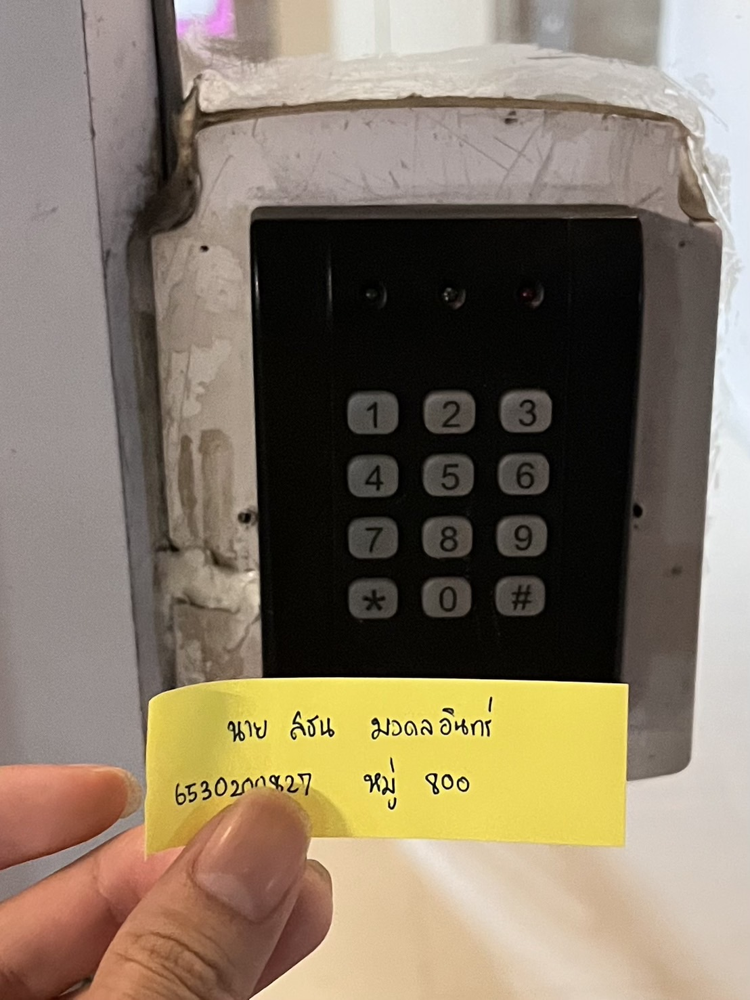

# Example of Security Controls in Daily Life

## Digital Door Lock (กลอนประตูดิจิตอล)

__สถานที่ : หอพักเย็นสบายไฮคลาส 224/66 หมู่ 8 ตำบลทุ่งสุขลา อำเภอศรีราชา ชลบุรี 20230__

- __Types of Security Controls: Physical Controls__ กลอนประตูดิจิทัลถือเป็นการควบคุมทางกายภาพที่จับต้องได้และมุ่งเน้นการปกป้องทรัพย์สิน 
รวมถึงเพิ่มความสะดวกสบายสำหรับผู้ใช้งาน นอกจากนี้ยังช่วยลดความเสี่ยงจากการใช้กุญแจแบบเดิมที่อาจสูญหายหรือถูกทำสำเนาได้

- __Control Functions: Preventative__ กลอนประตูดิจิทัลยังทำหน้าที่เป็นมาตรการควบคุมเชิงป้องกัน โดยช่วยป้องกันไม่ให้บุคคลที่ไม่ได้รับอนุญาตเข้าถึงพื้นที่ที่ต้องการความปลอดภัย โดยการใช้รหัสผ่านหรือระบบล็อกอิเล็กทรอนิกส์ที่ผู้ใช้งานสามารถกำหนดเองได้ 
สิ่งนี้ช่วยลดโอกาสที่การละเมิดความปลอดภัยจะเกิดขึ้น และสร้างความมั่นใจว่าพื้นที่จะปลอดภัย

__***ดังนั้น**__ กลอนประตูดิจิทัลเป็นการควบคุมทางกายภาพและเชิงป้องกันที่ช่วยป้องกันการเข้าถึงโดยไม่ได้รับอนุญาตผ่านระบบรหัสที่ปลอดภัยและใช้งานง่าย